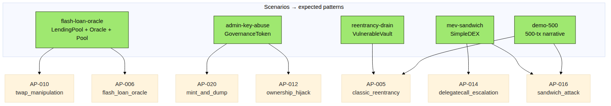

# 2. Capabilities at a glance

## 2.1 Detection coverage

- **60 detection signals** across 7 families (structural, behavioural,
  value, oracle, sequence, graph, additional).
- **38 attack patterns** (AP-001..AP-038) covering reentrancy,
  flash-loan oracle manipulation, admin-key abuse, MEV sandwich,
  token rugs, governance manipulation, mixer/bridge use, and more.
- Detection logic is **written in Elasticsearch query languages** —
  any analyst who knows ES can read, modify, and contribute rules.
  No Python required.

## 2.2 Fund tracing

- **5-hop BFS** in both directions from the victim and attacker.
- **Haircut taint scoring**: mixer × 0.7, bridge × 0.8, CEX × 0.9.
- **Known-address corpus**: Tornado Cash, Hop, Stargate, Multichain,
  Across, Binance, Coinbase, Kraken, OFAC SDN, notable past
  exploiters.

## 2.3 Copilot

- **Local LLM** (Ollama + Gemma 3 1B by default). No cloud. No data
  leaves the analyst's machine.
- **7-section forensic report**: Executive Summary, Timeline,
  Mechanism, Attribution, Fund Trail, Evidence, Remediation.
- **Strict anti-hallucination**: copilot prompts forbid invented
  addresses, hashes, amounts, or block numbers.

## 2.4 Coverage of demo scenarios

Five Foundry simulations ship in the repo, each reproducing a real
attack class end-to-end. ChainSentinel correctly identifies each one
purely from the ABIs + transaction data — without ever seeing the
attacker's source code.

| Scenario | Attack class | Patterns it triggers |
|----------|--------------|----------------------|
| `reentrancy-drain` | Classic recursive `withdraw` | AP-001, AP-030, AP-031 |
| `flash-loan-oracle` | Flash-loan-funded oracle manipulation | AP-006, AP-009, AP-033 |
| `admin-key-abuse` | Owner privilege abuse | AP-012, AP-020, AP-031 |
| `mev-sandwich` | Three-tx bracket sandwich | AP-016, AP-017 |
| `demo-500` | Mixed reentrancy + sandwich in 500 txs | AP-001, AP-016, AP-030, AP-031 |
