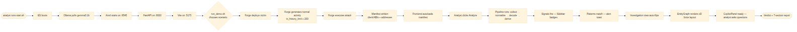

# 3. Demo storyline



A live demo runs as follows.

**Stage 1 — One command starts everything.** The analyst types
`./run_demo.sh demo-500`. In sequence: Elasticsearch boots, Ollama
warms up, Anvil launches as a local EVM, FastAPI starts on `:8000`,
the React frontend opens on `:5173`. About 60 seconds.

**Stage 2 — The chain populates.** Foundry deploys a vulnerable vault,
a simple DEX, and assorted ERC-20 tokens. A scripted backdrop runs ~300
legitimate transactions: deposits, swaps, transfers, approvals. Then
two exploits unfold inside the same window — a recursive `withdraw`
reentrancy on the vault, and a sandwich attack on the DEX.

**Stage 3 — Analysis starts.** The analyst clicks **Analyze**. The
workspace's `PipelineFeed` lights up:

```
[collect]   500 txs fetched
[normalize] timestamps + addresses canonicalised
[decode]    1247 events decoded, 0 unknown
[derive]    36 builder types produced
[ingest]    indexed in Elasticsearch
[signals]   8 signals fired (5 CRIT, 3 WARN)
[patterns]  3 patterns matched
[complete]  investigation ready
```

**Stage 4 — The verdict appears.** The workspace flips to the report
view. Two attack patterns: `AP-001 classic_reentrancy` and
`AP-016 sandwich_attack`. Three additional contextual alerts. The
entity graph shows the attacker EOA connected to a Tornado Cash
contract via two intermediary wallets.

**Stage 5 — The copilot writes the report.** The analyst clicks
**Generate Executive Summary**. Two paragraphs appear, in plain
English, ready to send to a client. The analyst asks *"summarise the
fund trail"*; a hop-by-hop narrative is produced.

**Stage 6 — The analyst is done.** Total elapsed time: under 15
minutes from `./run_demo.sh` to a client-ready report.
