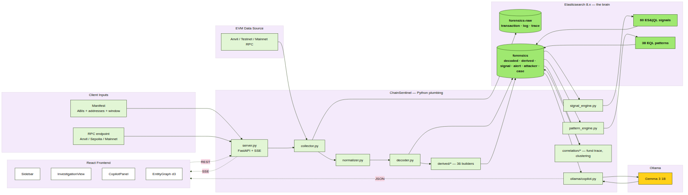

# 2. System architecture

## 2.1 The one-page picture



Five logical regions:

1. **Client inputs** — the manifest (ABIs + addresses + window) and an RPC URL.
2. **EVM data source** — Anvil for simulations, Sepolia/mainnet via Alchemy or
   Infura in production.
3. **Python plumbing** — FastAPI server, the pipeline (collector, normalizer,
   decoder, derived builders), and the two detection engines.
4. **Elasticsearch** — two indices and the queries that operate on them
   (60 ES|QL signals, 38 EQL patterns).
5. **Ollama + React UI** — the copilot and the three-column investigation
   workspace.

The single thing every region shares: an `investigation_id`. It is generated
by `pipeline.runner.generate_investigation_id()` at the start of every run
and threaded through every document, every signal, every alert, and every
copilot context.

## 2.2 Module responsibilities

| Module | Path | Responsibility | Detail in |
|--------|------|-----------------|-----------|
| FastAPI server | `chainsentinel/server.py` | REST + SSE entry point; 4 endpoints | D5 §3.1 |
| Runner | `pipeline/runner.py` | Orchestrate pipeline phases, yield SSE events | D5 §3.6 |
| Collector | `pipeline/collector.py` | Fetch tx + receipt + traces from RPC | D5 §3.2 |
| Normalizer | `pipeline/normalizer.py` | hex → int, lowercase addresses, ISO timestamps | D5 §3.5 |
| Decoder | `pipeline/decoder.py` | Decode events + fn calls via ABI registry | D5 §3.4 |
| Derived | `pipeline/derived/*.py` | 36 builders that synthesise higher-level events | D5 §3.7 |
| Ingest | `pipeline/ingest.py` | Bulk-index to ES with idempotent `_id`s | D5 §3.3 |
| Signal engine | `detection/signal_engine.py` | Discover + run `*.esql` against ES | D5 §3.8 |
| Pattern engine | `detection/pattern_engine.py` | Discover + run `*.eql` over signals | D5 §3.9 |
| Fund trace | `correlation/fund_trace.py` | BFS 5-hop, haircut taint scoring | D5 §3.10 |
| Clustering | `correlation/clustering.py` | Group wallets by signals (timing, funding, creator) | D5 §3.11 |
| Mixer detect | `correlation/mixer_detect.py` | Classify mixers, bridges, CEX | D5 §3.12 |
| Label DB | `correlation/label_db.py` | Known-address corpus | D5 §3.13 |
| ES setup | `es/setup.py` | Create indices + apply strict mappings | D5 §3.14 |
| Copilot | `ollama/copilot.py` | Build prompt + stream Ollama tokens | D5 §3.15 |
| Report template | `ollama/report_template.py` | Build structured context from ES | D5 §3.16 |
| Report sections | `ollama/report_sections.py` | 7-section forensic report generation | D5 §3.17 |
| Frontend | `chainsentinel/frontend/src/` | React 18 + Vite + d3 + Wise design system | D5 §4 |

## 2.3 Process topology

A single run touches five processes, all on `localhost` by default:

```
┌────────────┐    ┌──────────────┐    ┌───────────────┐
│ React UI   │ ◄─ │ FastAPI :8000│ ◄─ │ Python pipeline│
│ Vite :5173 │ SSE│  + worker    │    │  (in-process) │
└─────┬──────┘    └─────┬────────┘    └───────┬───────┘
      │ HTTP            │ HTTP                │ RPC
      │                 ▼                     ▼
      │           ┌──────────────┐     ┌───────────────┐
      └────────►  │ Ollama :11434│     │ Anvil  :8545  │
                  └─────┬────────┘     └───────────────┘
                        │
                        ▼
                  ┌──────────────┐
                  │ Elasticsearch│
                  │   :9200      │
                  └──────────────┘
```

`docker-compose.yml` runs Elasticsearch + Kibana in containers; `start.sh`
orchestrates Ollama, Anvil, FastAPI, and Vite on the host. The two are
deliberately decoupled — operators can swap ES for a remote cluster by
changing `config.json` and never touching the start script.
