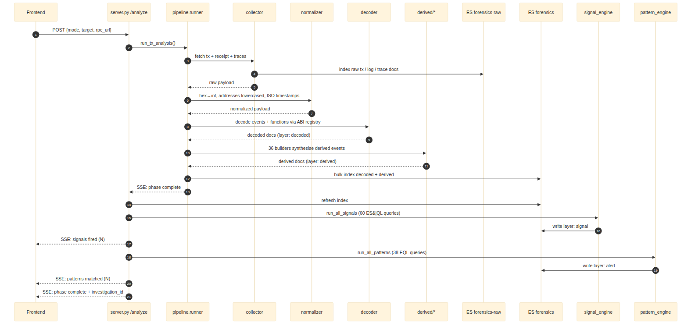
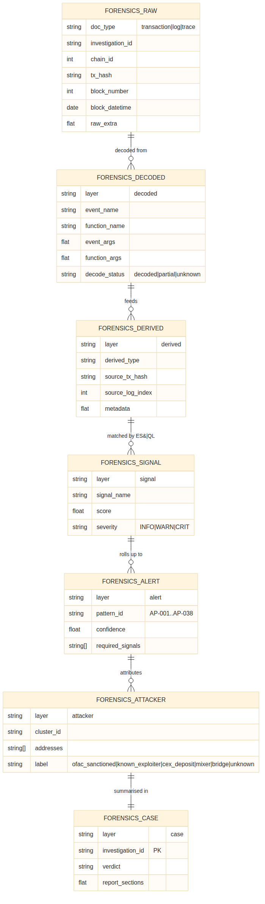

# 3. Data flow

## 3.1 End-to-end pipeline



A single tx-mode run produces, in order:

1. **Collection.** `collector.py` fetches the transaction, its receipt, all
   logs, and (if the RPC supports it) the full call trace. Each artefact is
   written to `forensics-raw` with `doc_type ∈ {transaction, log, trace}`.
2. **Normalisation.** `normalizer.py` rewrites hex strings to integers,
   lowercases every address, converts wei to ETH (storing both as
   `value_wei: keyword` and `value_eth: double`), and replaces every
   timestamp with ISO 8601 UTC. Any field the normaliser does not
   understand is preserved in `raw_extra` (a `flattened` field) so nothing
   is lost.
3. **Decoding.** `decoder.py` walks logs and function inputs, looks up the
   event signature (topic0) and function selector (first 4 bytes) in the
   ABI registry, and produces decoded documents with `layer: decoded`.
   The registry resolution order is **case ABIs → standards → protocols →
   selector cache**. Anything that cannot be resolved gets
   `decode_status: unknown`; partial matches get `partial`; clean matches
   get `decoded`.
4. **Derivation.** `pipeline/derived/*.py` runs 36 builders against the
   decoded stream and emits higher-level events with `layer: derived` and a
   `derived_type` keyword. Each derived event carries
   `source_tx_hash`, `source_log_index`, and `source_layer` so the
   provenance is always traceable back to the raw evidence.
5. **Ingest.** `ingest.py` bulk-indexes everything in chunks of
   `es_bulk_chunk_size` (default 500), using deterministic `_id` strings
   so re-running the same investigation overwrites instead of duplicating.
6. **Signal engine.** `signal_engine.py` discovers every `.esql` file
   under `detection/signals/`, substitutes `{investigation_id}` and
   `{chain_id}`, executes via `POST /_query`, and writes the results as
   `layer: signal` documents.
7. **Pattern engine.** `pattern_engine.py` does the same for every
   `.eql` file under `detection/patterns/`, runs them as
   sequence queries via `POST /_eql/search`, and writes results as
   `layer: alert` documents.
8. **Correlation.** When the pipeline finishes, `correlation/*.py` runs
   the BFS fund trace and wallet clustering, producing
   `layer: attacker` and `fund_flow_edge` documents.
9. **Case roll-up.** A single `layer: case` document captures the verdict
   and is the target for `GET /analysis/{investigation_id}` and the copilot.

Every phase yields an SSE event on the way through; the frontend's
`PipelineFeed` renders them in real time.

## 3.2 SSE event contract

The runner emits JSON payloads on the `pipeline` event stream:

```json
{
  "phase":    "collect" | "decode" | "derive" | "ingest" | "signals" | "patterns" | "complete" | "error",
  "msg":      "human-readable status line",
  "severity": "ok" | "warn" | "crit" | "gray",
  "esIndex":  "forensics-raw" | "forensics",
  "ts":       "HH:MM:SS",
  "stats":    { ... only on phase=complete ... }
}
```

The frontend keys colour and badging off `severity`; the analyst sees
`crit` events in red and `ok` events in Wise Green.

## 3.3 ES index model



Two strictly-mapped indices. Strict mapping (`dynamic: strict`) is a
deliberate choice: any future field added by a builder *must* be
declared in `es/mappings/*.json`. This prevents the mapping explosion
that often plagues blockchain indexing projects, where every contract
adds its own keyword fields.

Key mapping rules:

- Every address field is `keyword`, lowercased, and never analysed.
- `event_args`, `function_args`, `metadata`, and `raw_extra` are `flattened`
  to allow arbitrary content without inflating the mapping.
- `value_eth` is `double`; `value_wei` is `keyword` (because uint256
  exceeds the range of `long`).
- `score` is `float`; `severity` and `decode_status` are `keyword`.
- Each document has the seven mandatory shared fields:
  `investigation_id`, `chain_id`, `@timestamp`, `block_number`,
  `block_datetime`, `tx_hash`, and `layer` (or `doc_type` for raw).

`forensics-raw` exists separately from `forensics` to honour goal G2 —
evidence integrity. Nothing in the pipeline rewrites a raw document. If a
decode rule changes, only the `decoded` documents in `forensics` need to
be regenerated.

## 3.4 Deterministic document IDs

| Document | `_id` formula |
|----------|---------------|
| forensics-raw transaction | `{chain_id}_{tx_hash}` |
| forensics-raw log         | `{chain_id}_{tx_hash}_{log_index}` |
| forensics-raw trace       | `{chain_id}_{tx_hash}_trace` |
| forensics decoded         | `{investigation_id}_{tx_hash}_{log_index}_decoded` |
| forensics derived         | `{investigation_id}_{derived_type}_{tx_hash}_{log_index}` |
| forensics signal          | `{investigation_id}_{signal_name}_{tx_hash}` |
| forensics alert           | `{investigation_id}_{pattern_id}` |
| forensics attacker        | `{investigation_id}_{cluster_id}` |
| forensics case            | `{investigation_id}` |

This is goal G5 (idempotency) made concrete. The collector can be re-run
against the same tx without producing duplicates; the signal engine can
be re-run after a rule change without manual cleanup.
