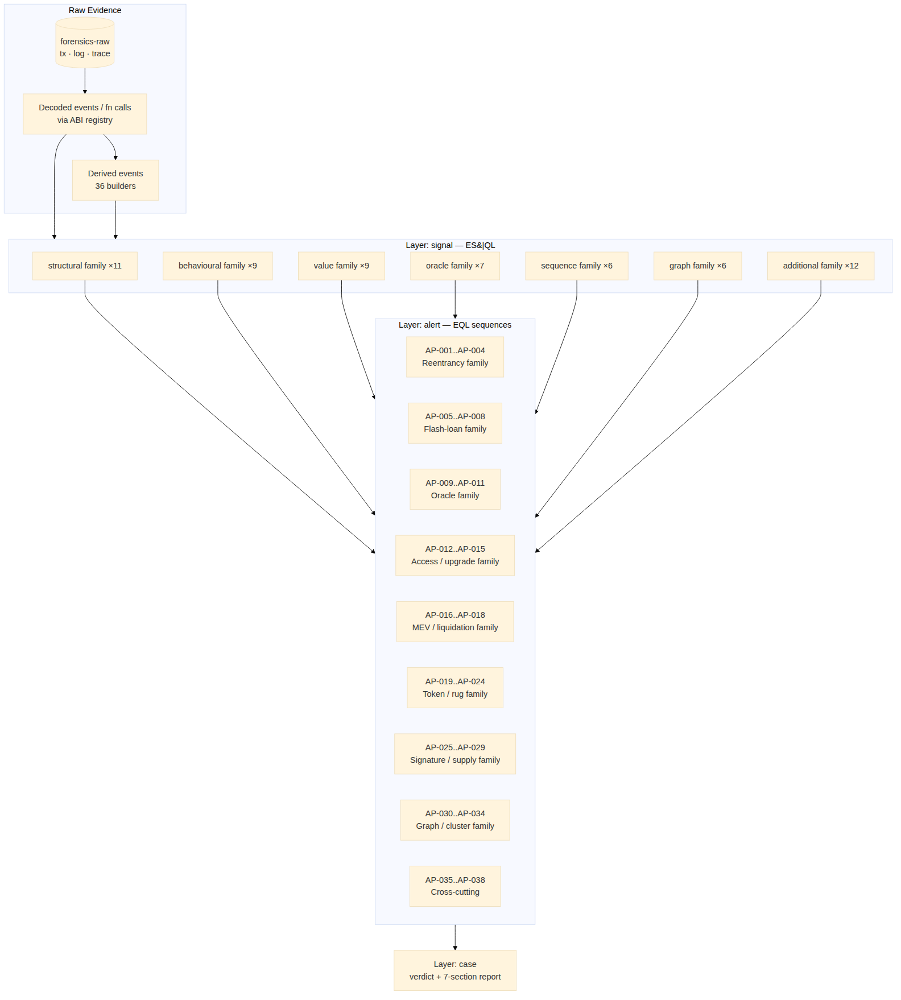

# 4. Detection model

## 4.1 The layer cake



Four logical layers in the `forensics` index distinguish *evidence* from
*interpretation*:

| Layer | Source | Document content |
|-------|--------|------------------|
| `decoded` | `pipeline.decoder` | Decoded events + function calls |
| `derived` | `pipeline.derived.*` | Synthesised events (value flows, reentrancy depth, …) |
| `signal`  | `detection.signal_engine` | A single suspicious finding from one `.esql` query |
| `alert`   | `detection.pattern_engine` | A multi-signal sequence matched by an `.eql` query |
| `attacker`| `correlation.clustering` | Inferred attacker cluster |
| `case`    | runner roll-up | Verdict + report sections, one per investigation |

This separation supports goal G1: a SISA analyst with Kibana access can
read every layer in isolation, follow the chain of inferences, and modify
a signal without touching Python.

## 4.2 Signals — ES|QL queries

`detection/signals/` contains **60 `.esql` files in 7 family folders**.
The signal engine:

```text
for each .esql file:
    text     = read file
    substituted = text.format(investigation_id=…, chain_id=…)
    rows     = es.esql_query(substituted)
    for row in rows:
        doc  = { layer: signal, signal_name: <file stem>,
                 score, severity, … row data }
        bulk_index(doc)
```

A signal scores in `[0, 1]` and carries a severity bucket. The bucket
threshold is `signal_score_threshold` from `config.json` (default `0.5`).
Anything below threshold still ingests as `INFO` so analysts can see
near-misses.

Families (with counts):

| Family | Count | Theme |
|--------|------:|-------|
| `structural` | 11 | Trace-level structure: reentrancy depth, flash-loan brackets, selfdestruct, proxy upgrade. |
| `behavioural`|  9 | Cross-tx behaviour: funding lineage, deployment timing, gas anomalies. |
| `value`      |  9 | Token / ETH value movement: drain ratios, dispersion, share-price spikes. |
| `oracle`     |  7 | Price-feed manipulation: TWAP drift, donation inflation, spot manipulation. |
| `sequence`   |  6 | Event ordering: missing events, deposit→withdraw same tx, ownership→drain. |
| `graph`      |  6 | Graph membership: mixer/bridge interactions, cluster identification, multi-hop trails. |
| `additional` | 12 | Cross-cutting: replay, integer overflow, fee-on-transfer, governance abuse. |

Full catalog: **D4 §2–9**.

## 4.3 Patterns — EQL sequences

`detection/patterns/` contains **38 `.eql` files** (AP-001..AP-038).
Each is a sequence query of the form:

```eql
sequence by investigation_id with maxspan=5m
  [ signal where signal_name == "flashloan_bracket_detected" ]
  [ signal where signal_name == "spot_price_manipulation" ]
  [ signal where signal_name == "drain_ratio_exceeded" ]
```

A pattern fires only when *all* of its required signals fire in the
specified order within the time window. Confidence is computed from
contributing signal scores and stored as `layer: alert` with
`pattern_id` set to the file's `AP-NNN` prefix.

Pattern families (informal grouping):

- **Reentrancy** — AP-001..AP-004 (classic, cross-function, read-only,
  ERC777 hook)
- **Flash loan** — AP-005..AP-008 (classic, oracle, governance, multi-pool)
- **Oracle** — AP-009..AP-011 (AMM spot, TWAP, multi-oracle inconsistency)
- **Access / upgrade** — AP-012..AP-015 (ownership hijack, uninit proxy,
  delegatecall escalation, selfdestruct drain)
- **MEV / liquidation** — AP-016..AP-018
- **Token / rug** — AP-019..AP-024
- **Signature / supply** — AP-025..AP-029
- **Graph / cluster** — AP-030..AP-034
- **Cross-cutting** — AP-035..AP-038

Full catalog: **D4 §10**.

## 4.4 Scoring model

A signal score is a function of evidence strength, normalised to `[0,1]`.
A pattern's confidence is a weighted product of contributing signal scores
plus a sequence-quality factor (do the signals appear in the expected
order? do they share a tx hash where they should?).

| Severity | Score range | UI badge | Trigger threshold |
|----------|-------------|----------|--------------------|
| `INFO`   | `< 0.5`     | grey     | Always ingested for analyst review |
| `WARN`   | `0.5..0.79` | yellow   | Appears in Sidebar badge count |
| `CRIT`   | `≥ 0.8`     | red      | Triggers toast notification |

Threshold is configurable via `signal_score_threshold` in `config.json`.
Per-signal weight tables live in **D4 §1**.

## 4.5 Adding detection — drop-a-file model

Per goal G3:

- **A new signal** → drop a `.esql` file under the correct family folder.
  The signal engine will discover and run it on next invocation. Naming
  rule: `snake_case.esql`; the stem becomes the `signal_name`.
- **A new pattern** → drop a `.eql` file under `detection/patterns/`.
  Naming rule: `AP-NNN_short_slug.eql`.
- **A new derived event** → add a `.py` file under `pipeline/derived/`
  that subclasses the `Builder` contract in `_base.py` and registers
  itself.
- **A new ABI** → drop a JSON under `pipeline/abi_registry/standards/`
  or, for client-specific contracts, under `cases/{investigation_id}/`.

The cookbook for each of these lives in **D5 §5–8**.
