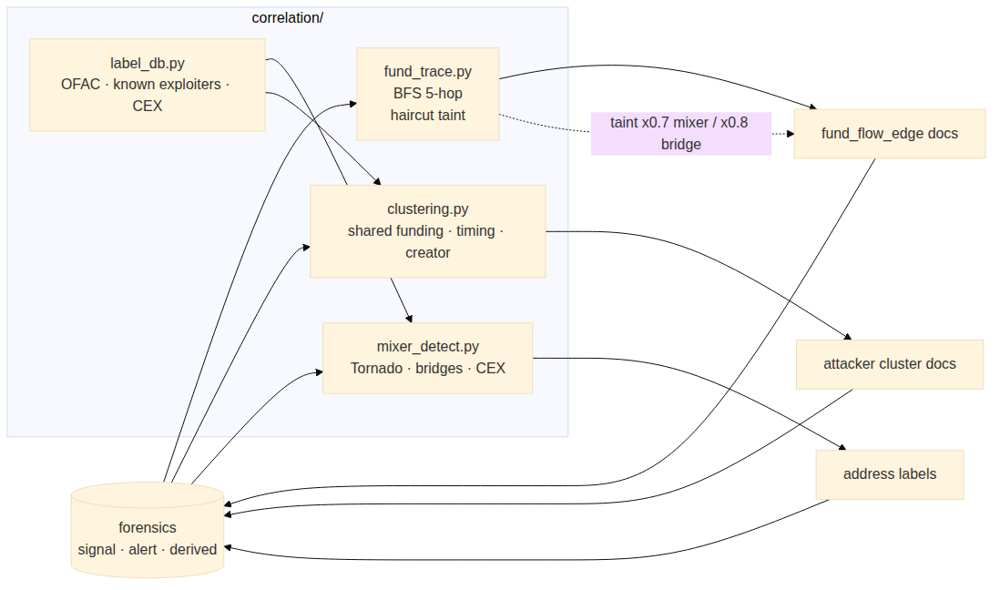
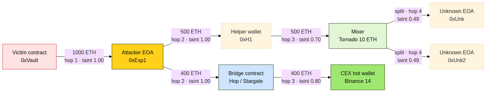

# 5. Correlation model

## 5.1 What correlation answers

Detection finds *what* happened. Correlation finds *who* and *where the
money went*. Three questions:

1. Which wallets are likely the same actor?
2. Where did funds flow before and after the exploit?
3. Have any of these addresses been seen before?

## 5.2 Fund tracing — BFS with haircut taint

`correlation/fund_trace.py` walks the value-transfer graph starting from
the victim and the attacker EOA. Each hop multiplies the *taint* scalar by
a haircut factor depending on the destination's classification:

| Destination class | Haircut | Rationale |
|-------------------|---------|-----------|
| Mixer (Tornado Cash, …) | × 0.7 | Funds are likely commingled with legitimate user funds. |
| Bridge (Hop, Stargate, …) | × 0.8 | Funds may have crossed chains and become unrecoverable. |
| CEX hot wallet (Binance, Coinbase, …) | × 0.9 | Subpoena route exists; partial recoverability assumed. |
| Unknown EOA | × 1.0 | Taint preserved fully. |

The walk respects `max_trace_hops` (default `5`) in both directions:
forward (from victim) and backward (to attacker funding source).

Output: a stream of `fund_flow_edge` documents with `(src, dst, value,
hop_index, taint, label_dst)`. The frontend's `EntityGraph` renders these
as a d3 force-directed layout.

## 5.3 Wallet clustering

`correlation/clustering.py` groups wallets that exhibit any of:

- **Shared funding source** — same EOA funded both wallets within a window.
- **Timing correlation** — both wallets active in the same block range
  with overlapping target contracts.
- **Common contract creator** — same deployer EOA (via the
  `contract_creator_graph` derived event).
- **Trace co-occurrence** — both wallets appear in the trace tree of
  the same transaction.

Each cluster gets a deterministic `cluster_id` (BLAKE2 hash of the sorted
address tuple) and is written as a `layer: attacker` document with the
labels assigned by `mixer_detect` + `label_db`.

## 5.4 Known-address corpus

`correlation/label_db.py` ships with a small static dataset of:

- 10 Tornado Cash variants (10 ETH, 100 ETH, USDC pools, …)
- Hop, Stargate, Multichain, Across bridges (mainnet contracts)
- Binance, Coinbase, Kraken known hot wallets
- OFAC SDN sanctioned addresses (initial seed)
- Notable past exploiter EOAs

Each address resolves to a `label ∈ {ofac_sanctioned, known_exploiter,
cex_deposit, mixer_contract, bridge_contract, protocol_treasury,
unknown}`. The corpus is stored in-memory as a dict; replace with a
remote intel API later by reimplementing the single `lookup()` function.
