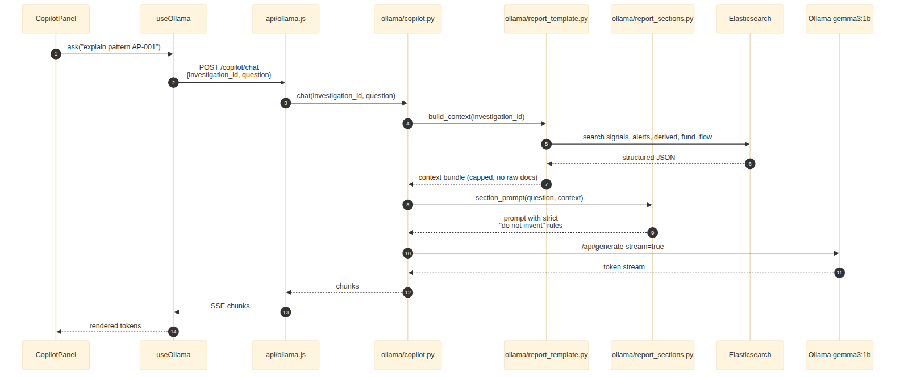

# 6. Copilot architecture

## 6.1 Goals

The copilot exists to translate forensic findings into prose an analyst
(or their client) can read. It must:

- Explain detected signals and patterns in plain English.
- Build a 7-section forensic report on demand.
- **Never invent** addresses, amounts, tx hashes, or block numbers
  (goal G9).

## 6.2 Three components



| File | Role |
|------|------|
| `ollama/report_template.py` | Builds the *context bundle* from ES: signals, alerts, derived events, fund-trace edges, attacker cluster summary. Always structured JSON, never raw documents. |
| `ollama/report_sections.py` | Defines the 7 report sections (Executive Summary, Attack Timeline, Technical Mechanism, Attacker Attribution, Fund Trail, Signal Evidence, Remediation Actions) and the strict prompt for each. |
| `ollama/copilot.py` | Streams completions from Ollama with prompt caching where supported; exposes a chat interface and a one-shot section generator. |

## 6.3 Prompt safety

Every system prompt includes:

```
You are summarising findings from a forensic analysis. You must NOT invent
any address, transaction hash, amount, block number, or contract name. If
the context does not include a fact, say so explicitly. If asked a question
the context cannot answer, refuse and ask for additional ES queries.
```

Per-section prompts further constrain the model: the Fund Trail section,
for example, is told that any `dst` address it mentions must appear in
the provided `fund_flow_edges` list, or it must use the phrase
*"address not in trace"*.

## 6.4 Model choice — Gemma 3 1B

The default is `gemma3:1b` (≈1 GB on disk). Reasons:

- Cheap enough to ship on an analyst laptop, no cloud dependency.
- 1B parameters is sufficient because the model only summarises and
  paraphrases; it does not reason about smart-contract code from
  scratch.
- Temperature pinned at `0.2` (`ollama_temperature` in `config.json`) to
  minimise variance between runs.

Operators can swap in a larger model (e.g. `llama3:8b`) by editing
`config.json`; the API contract with the copilot does not change.
