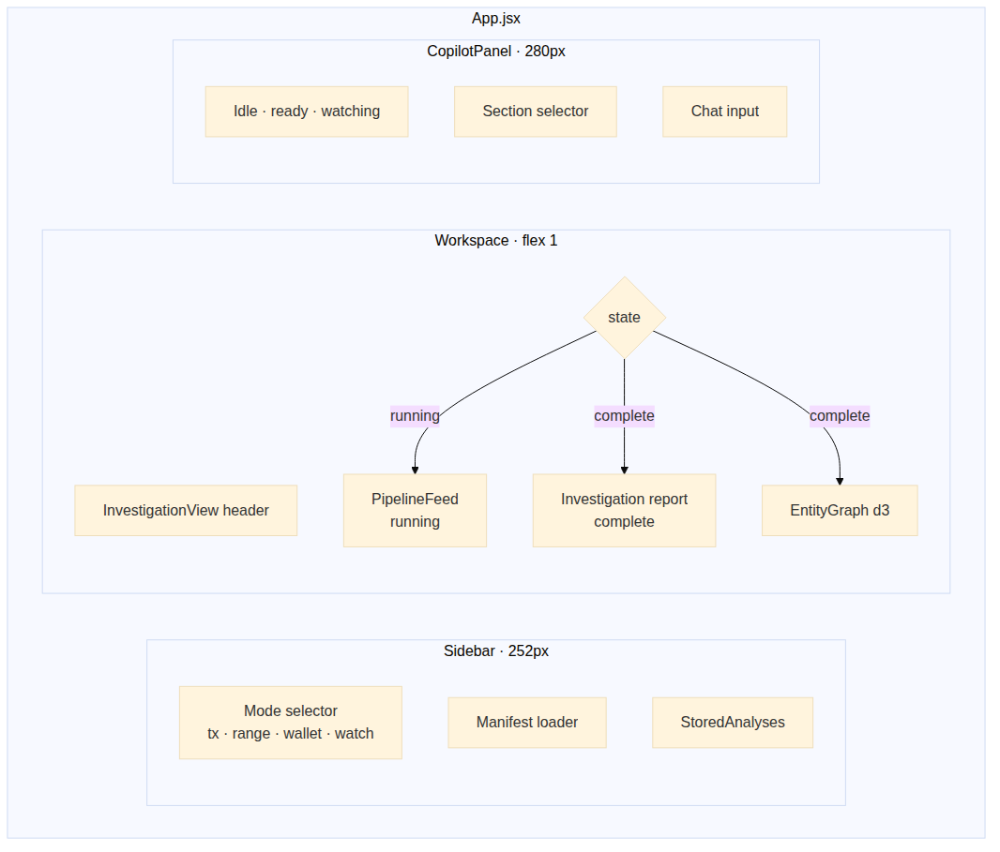
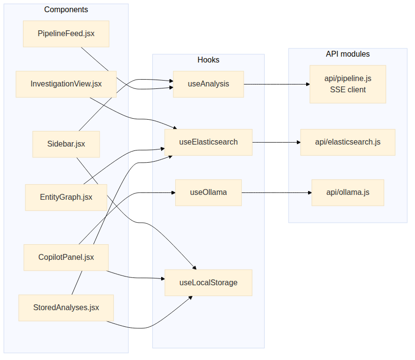

# 7. Frontend architecture

## 7.1 Three-column workspace

A single-page React 18 application built with Vite. Three columns:

- **Sidebar** (252 px) — mode selector, manifest loader, list of
  `StoredAnalyses` from `localStorage`.
- **Workspace** (flex 1) — `InvestigationView`. State machine:
  **Running** (renders `PipelineFeed`, the live SSE event log) →
  **Complete** (auto-flips to investigation report + `EntityGraph`).
- **CopilotPanel** (280 px) — chat interface, section selector, status
  badges (Idle / Watching / Ready).

## 7.2 Component × hook × API graph

| Component (`src/components/`) | Hooks | Purpose |
|---|---|---|
| `Sidebar` | `useAnalysis`, `useLocalStorage` | Run controls + history |
| `PipelineFeed` | `useAnalysis` | Live SSE stream renderer |
| `InvestigationView` | `useElasticsearch` | Report + state machine |
| `EntityGraph` | `useElasticsearch` | d3-force graph of fund flow |
| `CopilotPanel` | `useOllama`, `useLocalStorage` | LLM chat |
| `StoredAnalyses` | `useLocalStorage`, `useElasticsearch` | Past investigations |

| Hook | API module | Notes |
|---|---|---|
| `useAnalysis` | `api/pipeline.js` | Wraps the SSE EventSource for `/analyze` |
| `useElasticsearch` | `api/elasticsearch.js` | Direct ES queries (read-only) |
| `useOllama` | `api/ollama.js` | Streams completion tokens |
| `useLocalStorage` | — | Persistent UI state |

## 7.3 Wise design system

The UI uses a Wise-inspired palette and typography:

| Token | Value |
|-------|-------|
| `--near-black` | `#0e0f0c` |
| `--wise-green` | `#9fe870` |
| `--dark-green` | `#163300` |
| `--light-mint` | `#e2f6d5` |
| `--danger-red` | `#d03238` |
| `--warning-yellow` | `#ffd11a` |
| `--gray` | `#868685` |

Typography: Inter weight 600 body, weight 900 headings, monospace for
addresses, hashes, and amounts. Pill buttons use `border-radius: 9999px`;
cards use `border-radius: 30px`.

Styles live in `App.css` and per-component `*.css` files alongside the
`.jsx`. There is no separate tokens file — the variables are defined in
the `:root` block of `App.css`.
