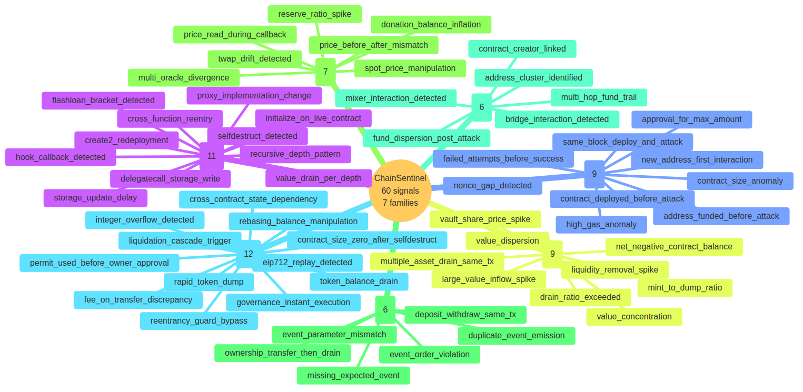

# 2. Signal catalog overview



ChainSentinel ships **60 signals** organised into seven families. Each
family lives in its own folder under `detection/signals/`:

```
chainsentinel/detection/signals/
├── structural/   (11 signals — trace-level structure)
├── behavioural/  ( 9 signals — cross-tx behaviour)
├── value/        ( 9 signals — token/ETH value movement)
├── oracle/       ( 7 signals — price-feed manipulation)
├── sequence/     ( 6 signals — event ordering)
├── graph/        ( 6 signals — graph membership)
└── additional/   (12 signals — cross-cutting)
```

The full enumeration follows in §3–§9. Each signal entry lists:

- **Stem** — file name without `.esql` extension; this is also the
  `signal_name` written into `forensics`.
- **File** — repo-relative path.
- **Inputs** — which `layer`s and `derived_type`s the query reads.
- **Score weight** — the literal or expression returned by the query.
- **False-positive notes** — known benign causes to filter out.
- **Example match** — a one-line description of a transaction that
  would fire it.

The auto-generated catalog table immediately below is the canonical
**by-family list** with file names. Hand-authored detail follows in the
per-signal subsections.

## 2.1 Auto-generated catalog

The next page contains the output of
`scripts/generate_catalog_tables.py` and is rebuilt by `make catalogs`.

\pagebreak



> **Build note.** During DOCX build, Pandoc inlines
> `src/_generated/signals_by_family.md` here via the
> `markdown_include` extension. If you are reading the Markdown source
> directly, open that file to see the full 60-row table.
