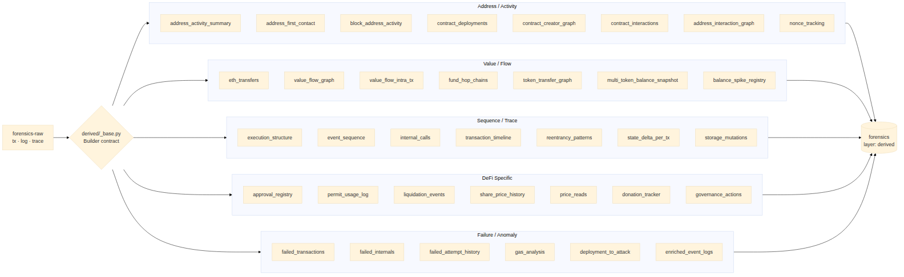

# 11. Derived event catalog (36 builders)

Derived events sit between the decoded raw data and the signal layer.
They synthesise *higher-level facts* (e.g. "value flowed from X to Y
through 3 hops", "reentrancy depth reached 4") that signal queries can
then match against without needing to recompute graph or trace
properties.



## 11.1 Builder contract

Every builder lives in `chainsentinel/pipeline/derived/` and inherits
the contract defined in `_base.py`:

```python
class Builder:
    derived_type: str   # keyword stored in forensics.derived_type
    requires: list[str] # what decoded/derived inputs it needs

    def emit(self, ctx: PipelineContext) -> Iterable[dict]:
        """Yield zero or more derived event documents."""
```

Output docs always include `layer = "derived"`, the `derived_type`
keyword, `source_tx_hash`, `source_log_index` (if applicable),
`source_layer`, and a `metadata` flattened field with arbitrary content.

## 11.2 Auto-generated catalog

The next page contains the output of `scripts/generate_catalog_tables.py`
parsing every builder module under `pipeline/derived/`. Module docstrings
become the descriptions.

\pagebreak



## 11.3 Builder groupings (informal)

| Group | Builders |
|-------|----------|
| Address / activity | `address_activity_summary`, `address_first_contact`, `address_interaction_graph`, `block_address_activity`, `contract_creator_graph`, `contract_deployments`, `contract_interactions`, `nonce_tracking` |
| Value / flow       | `eth_transfers`, `value_flow_graph`, `value_flow_intra_tx`, `fund_hop_chains`, `token_transfer_graph`, `multi_token_balance_snapshot`, `balance_spike_registry` |
| Sequence / trace   | `execution_structure`, `event_sequence`, `internal_calls`, `transaction_timeline`, `reentrancy_patterns`, `state_delta_per_tx`, `storage_mutations` |
| DeFi-specific      | `approval_registry`, `permit_usage_log`, `liquidation_events`, `share_price_history`, `price_reads`, `donation_tracker`, `governance_actions` |
| Failure / anomaly  | `failed_transactions`, `failed_internals`, `failed_attempt_history`, `gas_analysis`, `deployment_to_attack`, `enriched_event_logs` |

Most signals consume two or three builders; documenting which signals
consume which builder is left to the per-signal sections in §3–§9. The
inverse map — *which signals consume this builder* — can be regenerated
on demand by `grep -l <derived_type> chainsentinel/detection/signals/`.
