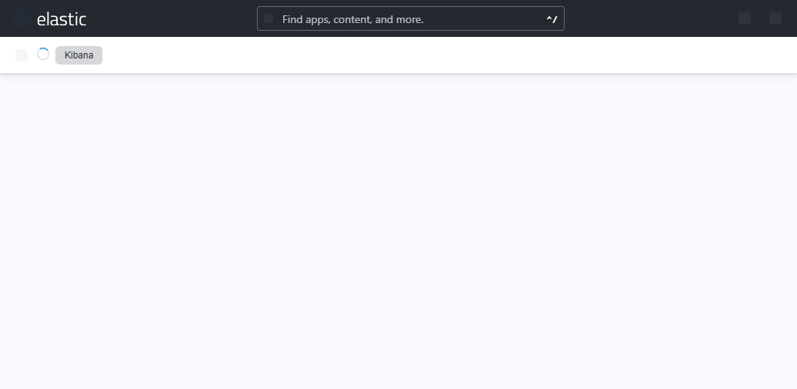

# 6. Kibana setup

Kibana is optional. ChainSentinel works fine without it — the React
frontend is the analyst's primary view. Kibana is for power users who
want to ad-hoc query the indices.

## 6.1 Running Kibana

The `docker-compose.yml` ships a Kibana 8.12.0 service:

```bash
docker compose up -d kibana
# wait ~30s, then open
open http://localhost:5601
```

## 6.2 Data views

ChainSentinel ships `chainsentinel/kibana_setup.py` which creates
data-view saved objects against the two indices:

```bash
KIBANA_URL=http://localhost:5601 python chainsentinel/kibana_setup.py
```

Result: two data views, `forensics-raw` and `forensics`, with
`@timestamp` as the time field.



## 6.3 Useful searches

| Question | KQL |
|----------|-----|
| "All signals for an investigation" | `layer: "signal" and investigation_id: "inv_2026-05-12_*"` |
| "Only CRIT severity" | `severity: "CRIT"` |
| "Reentrancy alerts" | `layer: "alert" and pattern_id: ("AP-001" or "AP-002" or "AP-003" or "AP-004")` |
| "Decoded swaps" | `layer: "decoded" and event_name: "Swap"` |
| "Raw traces for one tx" | `doc_type: "trace" and tx_hash: "0x..."` |
| "Unknown-decoded calls" | `decode_status: "unknown"` |

## 6.4 Discover layout

A useful default Discover layout:

- **Selected fields**: `@timestamp`, `severity`, `signal_name`,
  `score`, `tx_hash`, `block_number`.
- **Sort**: `@timestamp` descending.
- **Filter**: `layer: "signal"` + the investigation ID.
